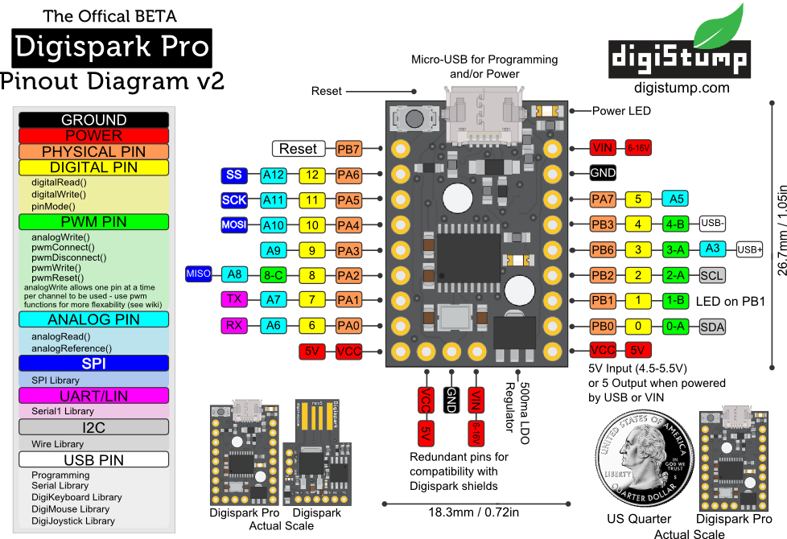
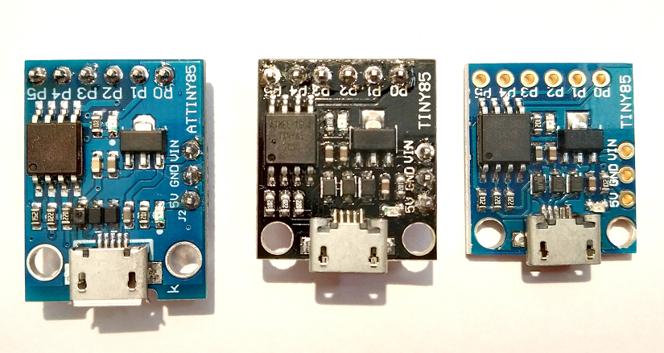
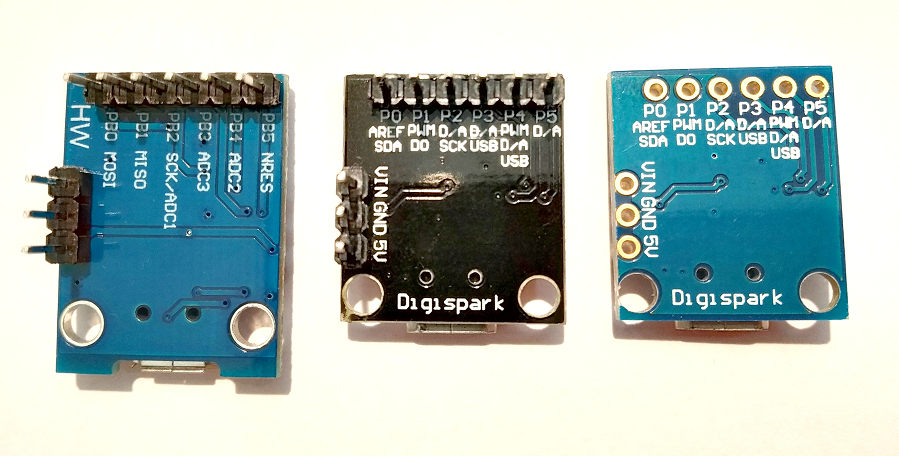
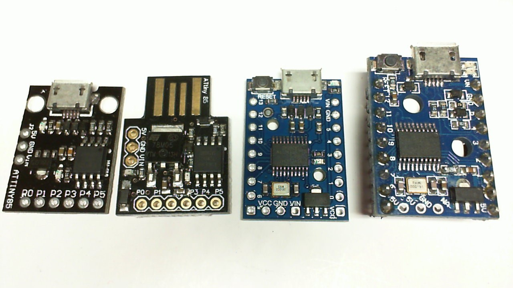

# Driver installation

Download it [here](https://github.com/digistump/DigistumpArduino/releases/download/1.6.7/Digistump.Drivers.zip), open it and run `InstallDrivers.exe`.



# Digispark clone and originals
On the photos below you see from left-to-right: a clone, an old genuine and a new genuine board. The clone is larger. You can tell from the locations of the (zener)diodes with respect to the Attiny85 and the powerLED orientation.
The value of the USB pullup resistor on a genuine Digispark Micro-USB is 1 kOhm (102). The series resistors are 22 Ohm.



# Installation of a better optimizing compiler configuration for ATtiny / Digispark boards

The new Digistump AVR version 1.6.8 shrinks generated code size by 5 to 15 percent. Just replace the old Digispark board URL **http://digistump.com/package_digistump_index.json** (e.g.in Arduino *File/Preferences*) by the new  **https://raw.githubusercontent.com/ArminJo/DigistumpArduino/master/package_digistump_index.json** and install the **Digistump AVR Boards** version **1.6.8**.

# Update the bootloader to the new version
To **update** your old flash consuming **bootloader**, jou have 2 choices.
1. Install the new Digistump board manager (see above), open the Arduino IDE, select *Tools/Programmer: "Micronucleus"* and then run *Tools/Burn Bootloder*.

The bootloader is the recommended configuration [`entry_on_power_on_no_pullup_fast_exit_on_no_USB`](firmware/configuration#recommended-configuration).
2. Run one of the Windows [scripts](https://github.com/ArminJo/micronucleus-firmware/tree/master/utils)
like e.g. the [Burn_upgrade-t85_default.cmd](utils/Burn_upgrade-t85_default.cmd).

# Pin layout
### ATtiny85 on Digispark

```
                       +-\/-+
 RESET/ADC0 (D5) PB5  1|    |8  VCC
  USB- ADC3 (D3) PB3  2|    |7  PB2 (D2) INT0/ADC1 - default TX Debug output for ATtinySerialOut
  USB+ ADC2 (D4) PB4  3|    |6  PB1 (D1) MISO/DO/AIN1/OC0B/OC1A/PCINT1 - (Digispark) LED
                 GND  4|    |5  PB0 (D0) OC0A/AIN0
                       +----+
  USB+ and USB- are each connected to a 3.3 volt Zener to GND and with a 68 Ohm series resistor to the ATtiny pin.
  On boards with a micro USB connector, the series resistor is 22 Ohm instead of 68 Ohm. 
  USB- has a 1k pullup resistor to indicate a low-speed device (standard says 1k5). 
  USB+ and USB- are each terminated on the host side with 15k to 25k pull-down resistors.
```

### ATtiny167 on Digispark pro
Digital Pin numbers in braces are for ATTinyCore library

```
                  +-\/-+
RX   6 (D0) PA0  1|    |20  PB0 (D8)  0 OC1AU
TX   7 (D1) PA1  2|    |19  PB1 (D9)  1 OC1BU - (Digispark) LED
     8 (D2) PA2  3|    |18  PB2 (D10) 2 OC1AV
INT1 9 (D3) PA3  4|    |17  PB3 (D11) 4 OC1BV USB-
           AVCC  5|    |16  GND
           AGND  6|    |15  VCC
    10 (D4) PA4  7|    |14  PB4 (D12)   XTAL1
    11 (D5) PA5  8|    |13  PB5 (D13)   XTAL2
    12 (D6) PA6  9|    |12  PB6 (D14) 3 INT0  USB+
     5 (D7) PA7 10|    |11  PB7 (D15)   RESET
                  +----+
  USB+ and USB- are each connected to a 3.3 volt Zener to GND and with a 51 Ohm series resistor to the ATtiny pin.
  USB- has a 1k5 pullup resistor to indicate a low-speed device.
  USB+ and USB- are each terminated on the host side with 15k to 25k pull-down resistors.

```