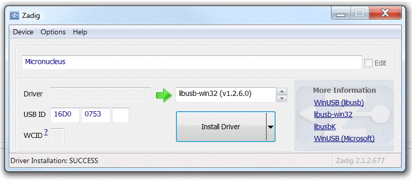

# Windows driver installation with Zadig #

Zadig is an automated windows driver installer for libusb devices. It will automatically create a driver signature, which prevents issues with unsigned drivers on Windows 10 and earlier. The latest version of Zadig can be found here: [http://zadig.akeo.ie/](http://zadig.akeo.ie/). For convenience, a copy is provided in this folder.

Please proceed as follows to install the Micronucleus driver:

1. Run Zadig_2.1.2.exe. The interface, as shown below, appears.
2. In the menu, go to *Device->Load Preset Device*.  Select micronucleus.cfg.
3. Click the "Install Driver" button.

The driver is now installed and Micronucleus should be ready to use. 

